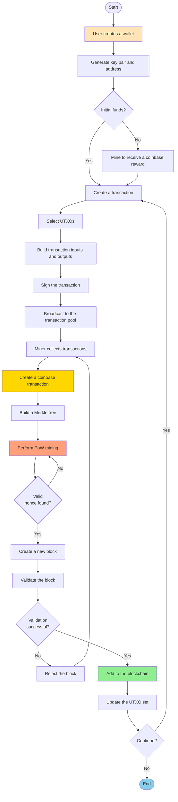
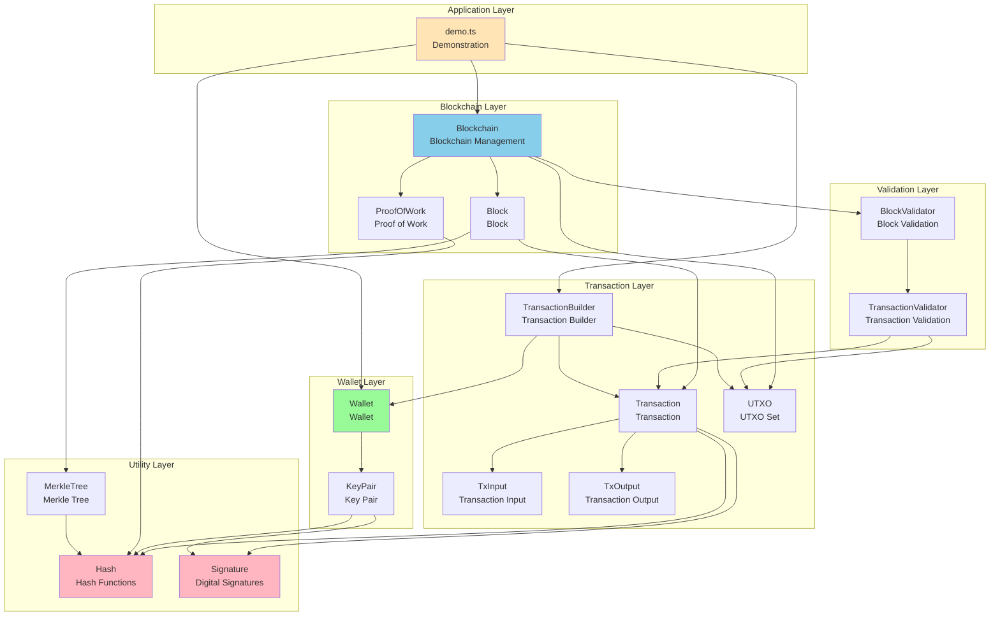
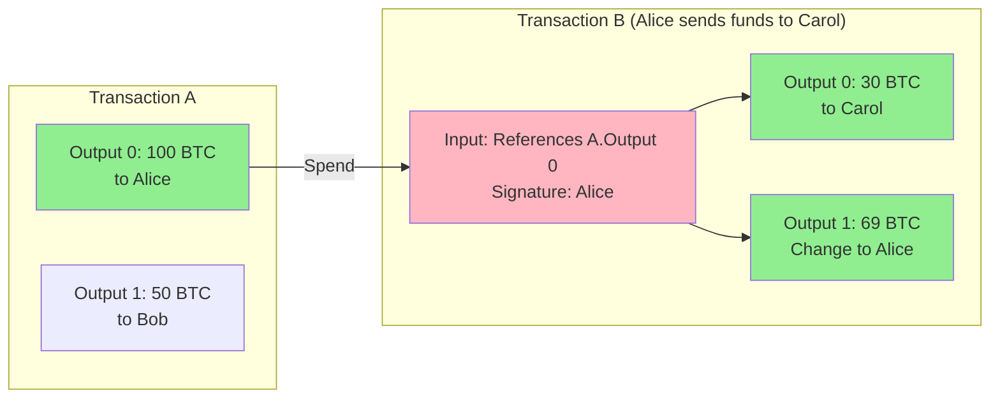
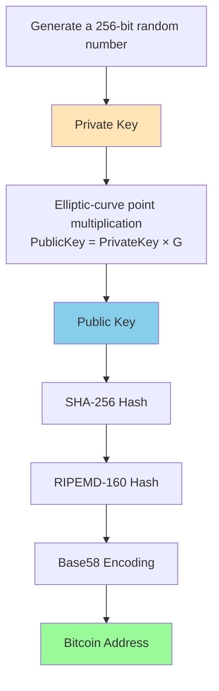
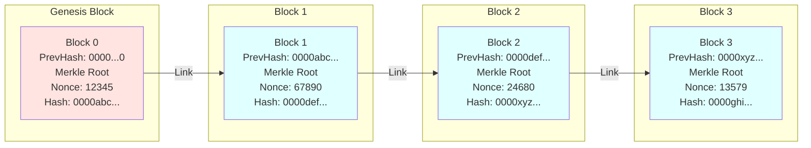
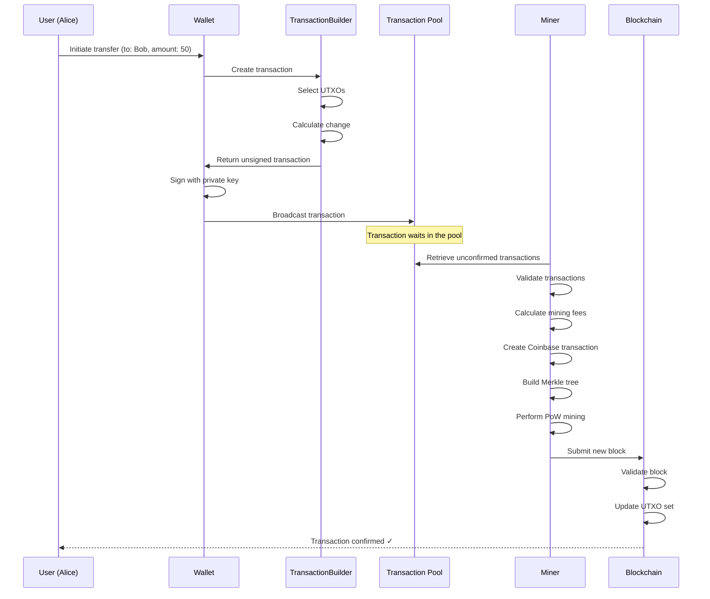
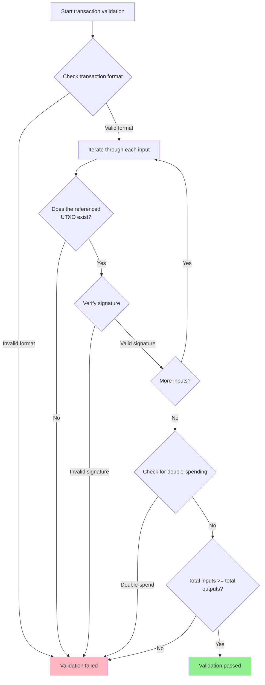
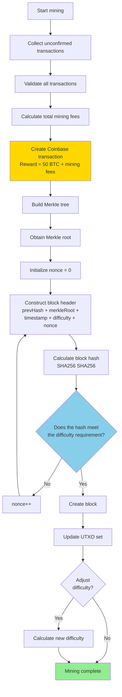

# Bitcoin System Technical Design

## 1. System Overview

This project is a simplified Bitcoin system implementation designed to demonstrate Bitcoin's core technical principles. It is implemented in TypeScript and includes core components such as the UTXO model, wallet system, Merkle trees, and proof of work.

### 1.1 Core Features

- **UTXO model**: An accounting model based on unspent transaction outputs
- **Elliptic-curve cryptography**: Uses ECDSA (secp256k1) for digital signatures
- **Proof of work**: SHA-256-based PoW consensus mechanism
- **Merkle trees**: Efficient transaction validation structure
- **Dynamic difficulty adjustment**: Automatically adjusts mining difficulty based on block production time

### 1.2 Overall System Workflow



## 2. System Architecture

### 2.1 Directory Structure

```
bitcoin/
├── src/
│   ├── crypto/           # Cryptographic foundations
│   │   ├── hash.ts       # Hash functions
│   │   └── signature.ts  # Digital signatures
│   ├── wallet/           # Wallet system
│   │   ├── KeyPair.ts    # Key pair
│   │   └── Wallet.ts     # Wallet
│   ├── transaction/      # Transaction system
│   │   ├── TxInput.ts    # Transaction input
│   │   ├── TxOutput.ts   # Transaction output
│   │   ├── UTXO.ts       # UTXO set
│   │   ├── Transaction.ts       # Transaction
│   │   └── TransactionBuilder.ts # Transaction builder
│   ├── merkle/           # Merkle tree
│   │   └── MerkleTree.ts
│   ├── blockchain/       # Blockchain core
│   │   ├── Block.ts      # Block
│   │   ├── Blockchain.ts # Blockchain
│   │   └── ProofOfWork.ts # Proof of work
│   ├── validator/        # Validators
│   │   ├── BlockValidator.ts       # Block validation
│   │   └── TransactionValidator.ts # Transaction validation
│   └── examples/         # Examples
│       └── demo.ts       # Complete demonstration
└── docs/
    └── TECH_DESIGN.md    # This document
```

### 2.2 Module Dependency Diagram



## 3. Core Concepts

### 3.1 UTXO Model

UTXO (Unspent Transaction Output) is Bitcoin's core accounting model. Unlike a traditional account-balance model, the UTXO model treats each transaction as a process that consumes old outputs and creates new outputs.

**Advantages**:
- Naturally supports concurrent processing because different UTXOs can be validated in parallel
- Makes double-spend attacks easy to detect
- Provides better privacy because each transaction can use a new address

**How it works**:
1. Transaction inputs reference existing UTXOs
2. Transaction outputs create new UTXOs
3. Total input value must be >= total output value
4. The difference becomes the mining fee

**UTXO transaction diagram**:



> Mining fee = 100 - (30 + 69) = 1 BTC

### 3.2 Digital Signatures (ECDSA)

The system uses the Elliptic Curve Digital Signature Algorithm (ECDSA) with the secp256k1 curve.

**Key generation**:
1. Private key: 256-bit random number
2. Public key: Private key × G (G is the curve's generator point)
3. Address: Base58(RIPEMD160(SHA256(public key)))

**Signing process**:
1. Calculate the transaction hash
2. Sign the hash with the private key
3. Generate the signature (r, s)

**Validation process**:
1. Verify the signature with the public key
2. Confirm that the signer controls the corresponding private key

**Address generation flowchart**:



### 3.3 Merkle Trees

A Merkle tree is a binary hash tree used to validate transactions in a block efficiently.

**Construction process**:
```
        Root
       /    \
     H01    H23
    /  \   /  \
   H0  H1 H2  H3
   |   |  |   |
  Tx0 Tx1 Tx2 Tx3
```

**Implementation approach**:
- Reference-based: Uses object references (`left`/`right`) to build a true tree structure
- Each node contains `hash` (node hash), `left` (left child reference), and `right` (right child reference)
- Recursive construction: Builds parent nodes level by level, beginning with the leaf nodes

**Advantages**:
- Requires only O(log n) hashes to verify whether a transaction is in a block
- Lightweight nodes can download only block headers and validate transactions as needed
- A reference-based implementation makes the code more intuitive and type-safe

### 3.4 Proof of Work (PoW)

Proof of work secures the blockchain by calculating a block hash that satisfies specified conditions.

**Mining process**:
1. Construct a block containing transactions, the previous block hash, the Merkle root, and other fields
2. Repeatedly try different nonce values
3. Calculate the block hash: SHA256(SHA256(block header))
4. Mining succeeds when the hash value is below the difficulty target

**Difficulty target**:
- Represented by the number of leading zeros
- For example, difficulty 4 requires the hash to begin with "0000"

**Difficulty adjustment**:
- Adjusts every 10 blocks
- Target block time: 10 seconds
- Adjustment formula: `new difficulty = old difficulty × (target time / actual time)`

**Blockchain structure diagram**:



## 4. Data Structures

### 4.1 Transaction Input (TxInput)

```typescript
interface TxInput {
  txId: string;        // Referenced transaction ID
  outputIndex: number; // Referenced output index
  signature: string;   // Signature
  publicKey: string;   // Public key
}
```

### 4.2 Transaction Output (TxOutput)

```typescript
interface TxOutput {
  amount: number;   // Amount
  address: string;  // Recipient address
}
```

### 4.3 Transaction

```typescript
interface Transaction {
  id: string;           // Transaction ID (hash of transaction content)
  inputs: TxInput[];    // Input list
  outputs: TxOutput[];  // Output list
  timestamp: number;    // Timestamp
}
```

### 4.4 Block

```typescript
interface Block {
  version: number;           // Version number
  previousHash: string;      // Previous block hash
  merkleRoot: string;        // Merkle root
  timestamp: number;         // Timestamp
  difficulty: number;        // Difficulty
  nonce: number;             // Nonce
  transactions: Transaction[]; // Transaction list
  hash: string;              // Block hash
}
```

**Detailed block structure diagram**:

```
┌─────────────────────────────────────────────────────────┐
│                      Block Header                       │
├─────────────────────────────────────────────────────────┤
│  Version: 1                                             │
│  Previous Hash: 0000abc123...                           │
│  Merkle Root: def456789...                              │
│  Timestamp: 1700000000                                  │
│  Difficulty: 4                                          │
│  Nonce: 123456                                          │
├─────────────────────────────────────────────────────────┤
│                      Block Hash                         │
│              0000xyz987... (calculated by PoW)         │
├─────────────────────────────────────────────────────────┤
│                      Transactions                       │
├─────────────────────────────────────────────────────────┤
│  [0] Coinbase transaction (mining reward)              │
│      ├─ Inputs: []                                      │
│      └─ Outputs: [50 BTC -> Miner Address]             │
├─────────────────────────────────────────────────────────┤
│  [1] Regular transaction                               │
│      ├─ Inputs: [ref TX_A output 0]                    │
│      └─ Outputs: [30 BTC -> Bob, 19 BTC -> Alice]      │
├─────────────────────────────────────────────────────────┤
│  [2] Regular transaction                               │
│      ├─ Inputs: [ref TX_B output 1]                    │
│      └─ Outputs: [10 BTC -> Carol]                     │
└─────────────────────────────────────────────────────────┘
```

### 4.5 Blockchain

```typescript
class Blockchain {
  chain: Block[];              // Blockchain
  difficulty: number;          // Current difficulty
  utxoSet: Map<string, TxOutput>; // UTXO set
  pendingTransactions: Transaction[]; // Pending transactions
}
```

## 5. Script System (Optional Extension)

### 5.1 Script System Overview

Bitcoin uses a stack-based scripting language to define transaction unlocking conditions. The script system provides flexibility and supports complex functionality such as multisignature, time locks, and hash locks.

#### Simplified vs. Script-Based Comparison

```typescript
// Simplified version (current implementation)
interface TxInput {
  txId: string
  outputIndex: number
  signature: string     // Store the signature directly
  publicKey: string     // Store the public key directly
}

interface TxOutput {
  amount: number
  address: string       // Store the address directly
}

// Script-based version (extended implementation)
interface TxInput {
  txId: string
  outputIndex: number
  scriptSig: string     // Unlocking script
  sequence: number
}

interface TxOutput {
  amount: number
  scriptPubKey: string  // Locking script
}
```

### 5.2 Script Execution Engine

#### 5.2.1 Stack

```typescript
class Stack {
  private items: Buffer[]
  
  push(item: Buffer): void
  pop(): Buffer | undefined
  peek(): Buffer | undefined
  size(): number
  clear(): void
}
```

#### 5.2.2 Script (Script Executor)

```typescript
class Script {
  private opcodes: OpCode[]
  
  constructor(script: string) {
    this.opcodes = this.parse(script)
  }
  
  // Parse a script string into an opcode sequence
  parse(script: string): OpCode[]
  
  // Execute the script
  execute(stack: Stack, transaction?: Transaction, inputIndex?: number): boolean
  
  // Serialize to bytecode
  serialize(): Buffer
  
  // Deserialize
  static deserialize(buffer: Buffer): Script
}
```

### 5.3 Opcodes (OpCodes)

#### 5.3.1 Constant Operations

```typescript
enum OpCode {
  // Constants
  OP_0 = 0x00,           // Push an empty byte array
  OP_FALSE = 0x00,       // Equivalent to OP_0
  OP_PUSHDATA1 = 0x4c,   // Push the next N bytes (N < 256)
  OP_PUSHDATA2 = 0x4d,   // Push the next N bytes (N < 65536)
  OP_1 = 0x51,           // Push the number 1
  OP_TRUE = 0x51,        // Equivalent to OP_1
  OP_2 = 0x52,           // Push the number 2
  // ... OP_3 through OP_16
}
```

#### 5.3.2 Stack Operations

```typescript
enum OpCode {
  OP_DUP = 0x76,         // Duplicate the top stack item
  OP_DROP = 0x75,        // Remove the top stack item
  OP_SWAP = 0x7c,        // Swap the top two stack items
  OP_PICK = 0x79,        // Copy the nth stack item to the top
  OP_ROLL = 0x7a,        // Move the nth stack item to the top
}
```

#### 5.3.3 Cryptographic Operations

```typescript
enum OpCode {
  OP_SHA256 = 0xa8,          // SHA-256 hash
  OP_HASH160 = 0xa9,         // SHA-256 + RIPEMD-160 hash
  OP_CHECKSIG = 0xac,        // Verify a signature
  OP_CHECKMULTISIG = 0xae,   // Verify multiple signatures
}
```

#### 5.3.4 Logical Operations

```typescript
enum OpCode {
  OP_EQUAL = 0x87,           // Compare the top two stack items for equality
  OP_EQUALVERIFY = 0x88,     // OP_EQUAL + OP_VERIFY
  OP_VERIFY = 0x69,          // Fail if the top stack value is false
  OP_RETURN = 0x6a,          // Mark a transaction output as unspendable
}
```

### 5.4 Standard Script Types

#### 5.4.1 P2PKH (Pay-to-Public-Key-Hash)

The most common transaction type, which pays a public key hash.

```typescript
// Locking script (scriptPubKey)
OP_DUP OP_HASH160 <pubKeyHash> OP_EQUALVERIFY OP_CHECKSIG

// Unlocking script (scriptSig)
<signature> <publicKey>

// Execution process:
// 1. Stack: [] 
// 2. Push signature: [signature]
// 3. Push publicKey: [signature, publicKey]
// 4. OP_DUP: [signature, publicKey, publicKey]
// 5. OP_HASH160: [signature, publicKey, hash(publicKey)]
// 6. Push pubKeyHash: [signature, publicKey, hash(publicKey), pubKeyHash]
// 7. OP_EQUALVERIFY: [signature, publicKey] (if the hashes match)
// 8. OP_CHECKSIG: [true] (if the signature is valid)
```

**ScriptBuilder construction**:

```typescript
class ScriptBuilder {
  // Build a P2PKH locking script
  static buildP2PKHLock(pubKeyHash: Buffer): Script {
    return new Script()
      .pushOp(OpCode.OP_DUP)
      .pushOp(OpCode.OP_HASH160)
      .pushData(pubKeyHash)
      .pushOp(OpCode.OP_EQUALVERIFY)
      .pushOp(OpCode.OP_CHECKSIG)
  }
  
  // Build a P2PKH unlocking script
  static buildP2PKHUnlock(signature: Buffer, publicKey: Buffer): Script {
    return new Script()
      .pushData(signature)
      .pushData(publicKey)
  }
}
```

#### 5.4.2 P2SH (Pay-to-Script-Hash)

Pays a script hash, allowing the recipient to define complex redemption conditions.

```typescript
// Locking script (scriptPubKey)
OP_HASH160 <scriptHash> OP_EQUAL

// Unlocking script (scriptSig)
<data> ... <redeemScript>

// Validation has two steps:
// 1. Verify that the redeemScript hash matches
// 2. Execute redeemScript to validate its conditions
```

**Use cases**: Multisignature wallets, escrow transactions, and smart contracts

#### 5.4.3 MultiSig (Multisignature)

Requires m-of-n signatures to spend.

```typescript
// 2-of-3 multisignature locking script
OP_2 <pubKey1> <pubKey2> <pubKey3> OP_3 OP_CHECKMULTISIG

// Unlocking script
OP_0 <signature1> <signature2>

// OP_CHECKMULTISIG validation:
// - Pop n (3) public keys from the stack
// - Pop m (2) signatures from the stack
// - Verify that at least m signatures are valid
```

**Note**: OP_CHECKMULTISIG has a historical bug that requires an additional OP_0 to be pushed

### 5.5 Script Execution Flow

```
┌─────────────────────────────────────────────────────────┐
│  1. Preparation                                          │
├─────────────────────────────────────────────────────────┤
│  - Create an empty stack                                 │
│  - Retrieve the transaction input's scriptSig            │
│  - Retrieve the referenced UTXO's scriptPubKey           │
└─────────────────────────────────────────────────────────┘
                        ↓
┌─────────────────────────────────────────────────────────┐
│  2. Execute scriptSig                                    │
├─────────────────────────────────────────────────────────┤
│  - Execute each opcode in scriptSig                      │
│  - Push data onto the stack                              │
└─────────────────────────────────────────────────────────┘
                        ↓
┌─────────────────────────────────────────────────────────┐
│  3. Execute scriptPubKey                                 │
├─────────────────────────────────────────────────────────┤
│  - Continue execution on the same stack                  │
│  - Run validation operations (such as OP_CHECKSIG)       │
└─────────────────────────────────────────────────────────┘
                        ↓
┌─────────────────────────────────────────────────────────┐
│  4. Check the Result                                     │
├─────────────────────────────────────────────────────────┤
│  - If the top stack value is true (nonzero), validation passes ✓ │
│  - Otherwise, validation fails ✗                         │
└─────────────────────────────────────────────────────────┘
```

### 5.6 Security Limits

Script execution requires the following limits to prevent DoS attacks and resource abuse:

```typescript
const SCRIPT_LIMITS = {
  MAX_SCRIPT_SIZE: 10000,           // Maximum script size (bytes)
  MAX_SCRIPT_ELEMENT_SIZE: 520,     // Maximum element size (bytes)
  MAX_OPS_PER_SCRIPT: 201,          // Maximum number of opcodes
  MAX_STACK_SIZE: 1000,             // Maximum stack depth
  MAX_PUBKEYS_PER_MULTISIG: 20,     // Maximum public keys in multisignature
}
```

### 5.7 Script Validator

```typescript
class ScriptValidator {
  // Validate the script for a transaction input
  validateInput(
    transaction: Transaction,
    inputIndex: number,
    utxoSet: UTXOSet
  ): boolean {
    const input = transaction.inputs[inputIndex]
    const referencedUTXO = utxoSet.get(input.txId, input.outputIndex)
    
    if (!referencedUTXO) {
      return false // UTXO does not exist
    }
    
    // Create the stack
    const stack = new Stack()
    
    // Parse the scripts
    const scriptSig = Script.deserialize(input.scriptSig)
    const scriptPubKey = Script.deserialize(referencedUTXO.scriptPubKey)
    
    // Execute scriptSig
    if (!scriptSig.execute(stack, transaction, inputIndex)) {
      return false
    }
    
    // Execute scriptPubKey
    if (!scriptPubKey.execute(stack, transaction, inputIndex)) {
      return false
    }
    
    // Check the result at the top of the stack
    if (stack.size() === 0) {
      return false
    }
    
    const result = stack.pop()
    return this.isTrue(result)
  }
  
  private isTrue(value: Buffer): boolean {
    // An empty byte sequence or an all-zero byte sequence is false
    if (value.length === 0) return false
    for (let i = 0; i < value.length; i++) {
      if (value[i] !== 0) {
        // Special case: negative zero
        if (i === value.length - 1 && value[i] === 0x80) {
          return false
        }
        return true
      }
    }
    return false
  }
}
```

### 5.8 Backward Compatibility

A compatibility layer preserves the usability of the simplified interface:

```typescript
class TransactionCompat {
  // Convert the simplified version to the script-based version
  static toScriptMode(simpleTx: SimpleTransaction): ScriptTransaction {
    const scriptTx = { ...simpleTx, inputs: [], outputs: [] }
    
    // Convert inputs
    for (const input of simpleTx.inputs) {
      const scriptSig = ScriptBuilder.buildP2PKHUnlock(
        Buffer.from(input.signature, 'hex'),
        Buffer.from(input.publicKey, 'hex')
      )
      
      scriptTx.inputs.push({
        txId: input.txId,
        outputIndex: input.outputIndex,
        scriptSig: scriptSig.serialize().toString('hex'),
        sequence: 0xffffffff
      })
    }
    
    // Convert outputs
    for (const output of simpleTx.outputs) {
      const pubKeyHash = this.addressToPubKeyHash(output.address)
      const scriptPubKey = ScriptBuilder.buildP2PKHLock(pubKeyHash)
      
      scriptTx.outputs.push({
        amount: output.amount,
        scriptPubKey: scriptPubKey.serialize().toString('hex')
      })
    }
    
    return scriptTx
  }
  
  // Convert the script-based version back to the simplified version (P2PKH only)
  static toSimpleMode(scriptTx: ScriptTransaction): SimpleTransaction
}
```

## 6. Core Algorithms

### 6.1 Address Generation Algorithm

```
1. Generate a private key (256-bit random number)
2. Calculate public key = private key × G (elliptic curve point multiplication)
3. Calculate SHA-256(public key)
4. Calculate RIPEMD-160(SHA-256 result)
5. Encode with Base58 to obtain the address
```

### 6.2 Transaction Signing Algorithm

```
1. Construct the transaction content (without signatures)
2. Serialize the transaction content
3. Calculate SHA-256(transaction content)
4. Sign the hash with the ECDSA private key
5. Add the signature to the transaction input
```

**Transaction lifecycle**:



### 6.3 Transaction Validation Algorithm

```
1. Check whether the transaction format is correct
2. Verify the signature of each input
3. Check whether each referenced UTXO exists
4. Verify that total inputs >= total outputs
5. Check for double-spending
```

**Transaction validation flowchart**:



### 6.4 UTXO Selection Algorithm

Building a transaction requires selecting suitable UTXOs as inputs:

```
1. Retrieve all available UTXOs for the address
2. Sort them by amount in descending order
3. Select greedily until the total >= the target amount
4. Calculate change = total inputs - target amount - mining fee
5. If change > 0, create a change output
```

### 6.5 Merkle Tree Construction Algorithm (Pure Pointer-Based Approach)

We implement the Merkle tree using a pure pointer-based approach (object references), building a true tree structure through references between nodes:

```
1. Create a leaf node object for each transaction hash (containing the hash, left, and right fields)
2. Pair nodes to build parent nodes:
   - If the number of nodes is odd, pair the last node with itself
   - Create a parent node, setting left and right to references to its child nodes
   - Calculate parent node hash = SHA256(left.hash + right.hash)
3. Use the array of parent nodes as the new current level
4. Recursively perform steps 2-3 until only one root node remains
5. The remaining root node is the root of the Merkle tree

Implementation advantages:
- Object references are more intuitive than array indexes
- The complete tree structure is retained, making traversal and proof generation easier
- TypeScript type safety provides compile-time checks
```

### 6.6 Proof-of-Work Algorithm

```
1. Initialize nonce = 0
2. Construct the block header (previousHash + merkleRoot + timestamp + difficulty + nonce)
3. Calculate hash = SHA256(SHA256(block header))
4. Check whether the hash meets the difficulty requirement (number of leading zeros)
5. If not, increment nonce and return to step 3
6. If it does, return the nonce and hash
```

**Mining flowchart**:



### 6.7 Difficulty Adjustment Algorithm

```
1. Check every 10 blocks
2. Calculate actual block time = (current block time - block N-9 time) / 10
3. Target time = 10 seconds
4. If actual time < target time, difficulty += 1 (increase difficulty)
5. If actual time > target time × 2, difficulty -= 1 (decrease difficulty)
6. The minimum difficulty is 1
```

## 7. Security Considerations

### 7.1 Double-Spend Protection

- Under the UTXO model, each output can be spent only once
- Transaction validation checks the UTXO set and rejects repeated spending
- The longest-chain rule makes confirmed transactions difficult to reverse

### 7.2 51% Attack

- An attacker must control more than 51% of the computing power
- The cost increases as the network's computing power grows
- This implementation is for educational purposes and does not address real-world network security

### 7.3 Signature Security

- Uses the secp256k1 elliptic curve, as Bitcoin does
- Private keys are never transmitted; only signatures and public keys are transmitted
- Each address should be used only once (for privacy)

## 8. Performance Optimizations

### 8.1 UTXO Index

The UTXO set is stored in a Map data structure, providing O(1) lookup performance.

Key format: `${txId}:${outputIndex}`

### 8.2 Merkle Tree Caching

Once a block is created, its Merkle root does not change and can be cached to avoid repeated calculations.

### 8.3 Parallel Validation

Proof of work for different blocks can be validated in parallel, but this implementation processes it sequentially for simplicity.

## 9. Limitations and Simplifications

This implementation is intended for educational purposes and makes the following simplifications:

1. **No network layer**: P2P network communication is not implemented
2. **No persistence**: Data is stored only in memory
3. **Simplified scripts**: Bitcoin's script system is not implemented
4. **Fixed difficulty range**: The difficulty value is a simple integer
5. **No block size limit**: Real Bitcoin has a 1 MB limit
6. **No Segregated Witness**: SegWit is not implemented
7. **No transaction pool management**: Unconfirmed transaction processing is simplified

## 10. Future Extensions

1. **Script system** ⭐ (planned - see Milestone 4.5):
   - Implement a stack-based script engine
   - Support P2PKH, P2SH, and MultiSig
   - Provide a backward-compatible simplified mode

2. **P2P network**: 
   - Implement node discovery and block broadcasting
   - Implement the gossip protocol
   - Serialize and validate network messages

3. **Persistent storage**: 
   - Store the blockchain with LevelDB/SQLite
   - Persist the UTXO set
   - Optimize blockchain database indexes

4. **Light node support**: 
   - Implement SPV (Simplified Payment Verification)
   - Validate Merkle proofs
   - Synchronize block headers

5. **Advanced transaction types**:
   - Time-locked transactions (CheckLockTimeVerify)
   - Relative time locks (CheckSequenceVerify)
   - Atomic swaps

6. **Segregated Witness (SegWit)**:
   - Separate signature data
   - Address transaction malleability
   - Increase block capacity

7. **Lightning Network**: 
   - Implement off-chain payment channels
   - HTLC (Hashed Timelock Contract)
   - Routing and network topology

8. **Smart contracts**: 
   - Extend script system capabilities
   - Implement a Turing-complete virtual machine
   - Manage state and contract storage

## 11. References

- [Bitcoin Whitepaper](https://bitcoin.org/bitcoin.pdf) - Satoshi Nakamoto
- [Mastering Bitcoin](https://github.com/bitcoinbook/bitcoinbook) - Andreas M. Antonopoulos
- [Bitcoin Developer Guide](https://developer.bitcoin.org/devguide/)
- [secp256k1 Curve](https://en.bitcoin.it/wiki/Secp256k1)
 
